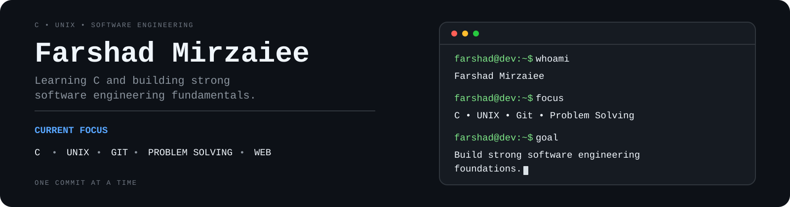

  

 

# Hi, I'm Farshad

I'm currently learning C and software engineering fundamentals while preparing for the 42 Piscine.

Alongside that, I continue to build front-end projects and strengthen my understanding of programming, problem-solving, UNIX/Linux, and computer science.

## Current Focus

- Working through *C Programming: A Modern Approach* by K. N. King
- Solving programming exercises and projects in C
- Preparing for the 42 Piscine
- Improving my problem-solving skills
- Continuing to develop front-end projects

---

<h2 align="center">🛠 Tech Stack</h2>

<table align="center">
  <tr>
    <th width="300" align="center">Systems Programming</th>
    <th width="300" align="center">Web Development</th>
    <th width="300" align="center">Tools</th>
  </tr>
  <tr>
    <td align="center">
      &nbsp;&nbsp;&nbsp;
      &nbsp;&nbsp;&nbsp;
      
    </td>
    <td align="center">
      &nbsp;&nbsp;&nbsp;
      &nbsp;&nbsp;&nbsp;
      
    </td>
    <td align="center">
      &nbsp;&nbsp;&nbsp;
      &nbsp;&nbsp;&nbsp;
      
    </td>
  </tr>
</table>

---
## Learning Repositories

**C Programming: A Modern Approach**

My solutions to the exercises and programming projects from K. N. King's book as I build a strong foundation in C.

🔗 https://github.com/farshad-mirzaiee/c-programming-a-modern-approach

---

**The Odin Project**

A collection of projects completed while learning front-end development through The Odin Project.

🔗 ...
---

<h2 align="center">🐍 Contribution Graph</h2>

  <picture>
    <source media="(prefers-color-scheme: dark)" srcset="https://raw.githubusercontent.com/farshad-mirzaiee/farshad-mirzaiee/output/github-snake-dark.svg">
    <source media="(prefers-color-scheme: light)" srcset="https://raw.githubusercontent.com/farshad-mirzaiee/farshad-mirzaiee/output/github-snake.svg">
    
  </picture>

